<div align="center">
  
</div>

<h1 align="center">🚀 Rise Together</h1>

<p align="center">
  <strong>Learn. Build. Grow.</strong><br>
  Empowering the next generation of tech leaders through collaborative learning and innovation.
</p>

<div align="center">

[](https://www.djangoproject.com/)
[](https://www.python.org/)
[](https://tailwindcss.com/)

[🌐 Live Demo](https://risetogether.tech) • [🐛 Report Bug](https://github.com/logicbyroshan/social-community-platform/issues) • [✨ Request Feature](https://github.com/logicbyroshan/social-community-platform/issues)

</div>

---

## 🌟 About The Project

**Rise Together** is a vibrant community platform designed to bring together aspiring developers, tech enthusiasts, and innovators. Our mission is to create a collaborative ecosystem where members can learn new technologies, work on real-world projects, share resources, and grow together as a community.

---

## ✨ Key Features

- 🔐 **User Authentication & Profiles** - Secure login, customizable profiles, and password recovery
- 📝 **Community Blog** - Rich text editor, categories, tags, and featured posts
- 🛠️ **Projects Showcase** - Browse projects, tech tags, and live demo links
- 🎯 **Activities & Events** - Track events, participation, and earn achievement badges
- 📚 **Resource Library** - Curated learning materials with community ratings
- 🎨 **Modern UI/UX** - Responsive design, dark theme, glassmorphism effects

---

## 📸 Screenshots

<div align="center">

<table>
  <tr>
    <td width="50%">
      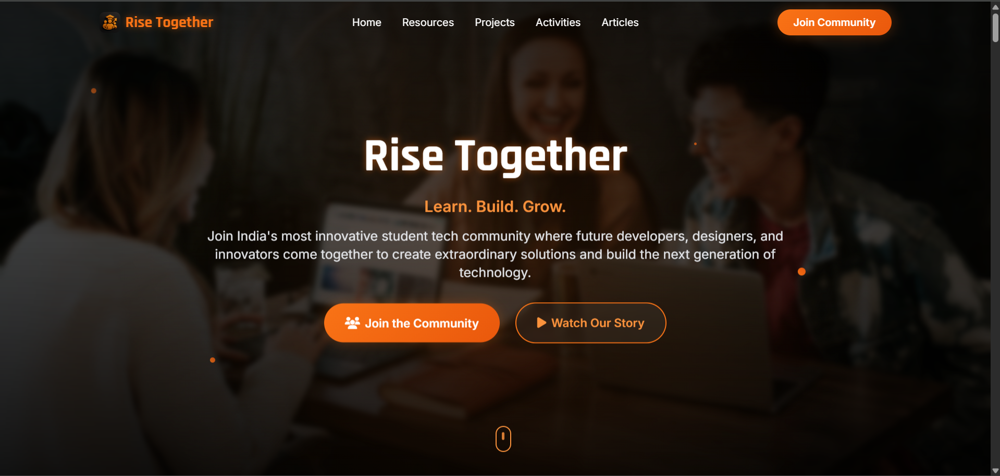
      <p align="center"><em>Beautiful hero section with gradient effects</em></p>
    </td>
    <td width="50%">
      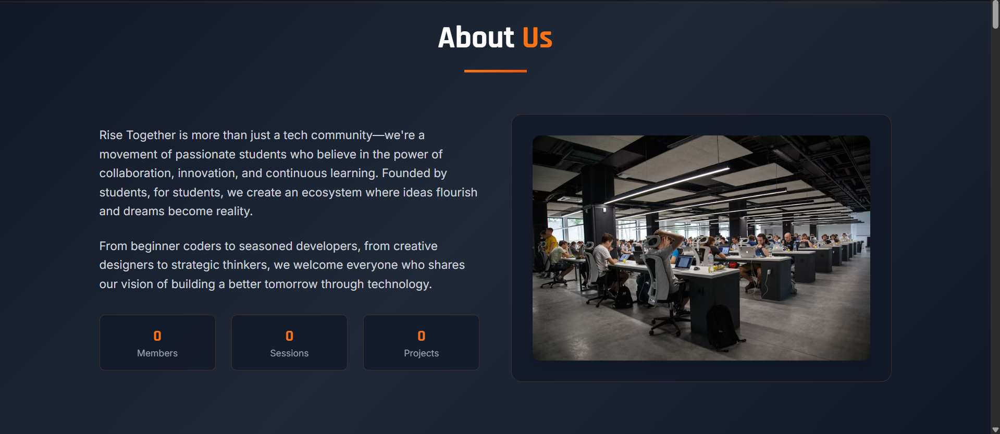
      <p align="center"><em>About section showcasing our mission</em></p>
    </td>
  </tr>
</table>

<table>
  <tr>
    <td width="50%">
      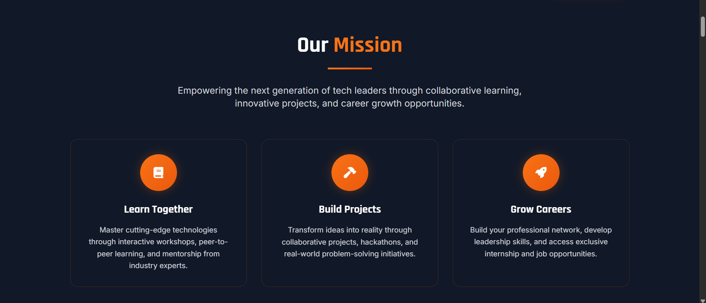
      <p align="center"><em>Our mission and values</em></p>
    </td>
    <td width="50%">
      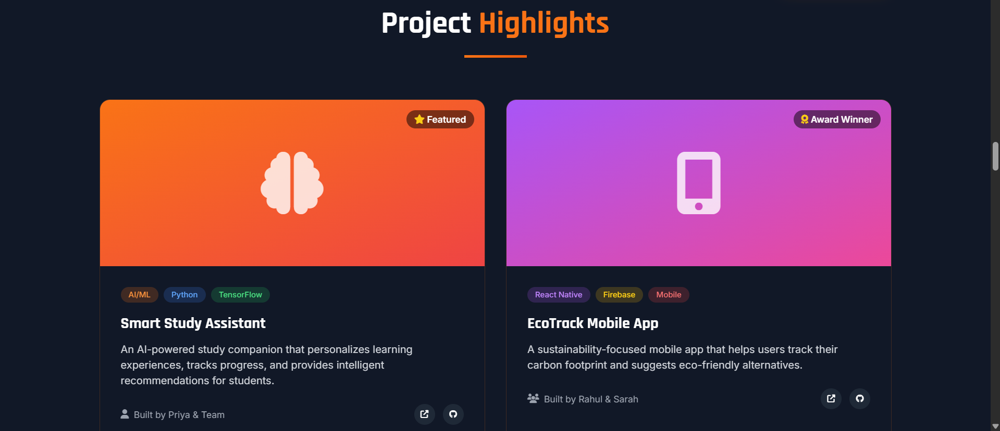
      <p align="center"><em>Community projects with tech tags</em></p>
    </td>
  </tr>
</table>

<table>
  <tr>
    <td width="50%">
      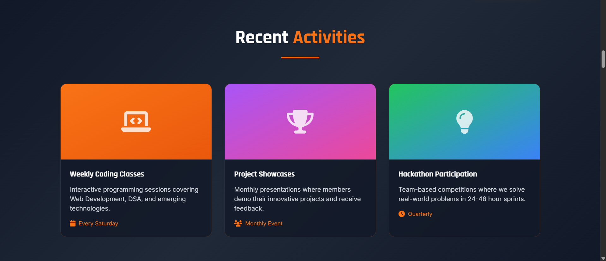
      <p align="center"><em>Track community events and activities</em></p>
    </td>
    <td width="50%">
      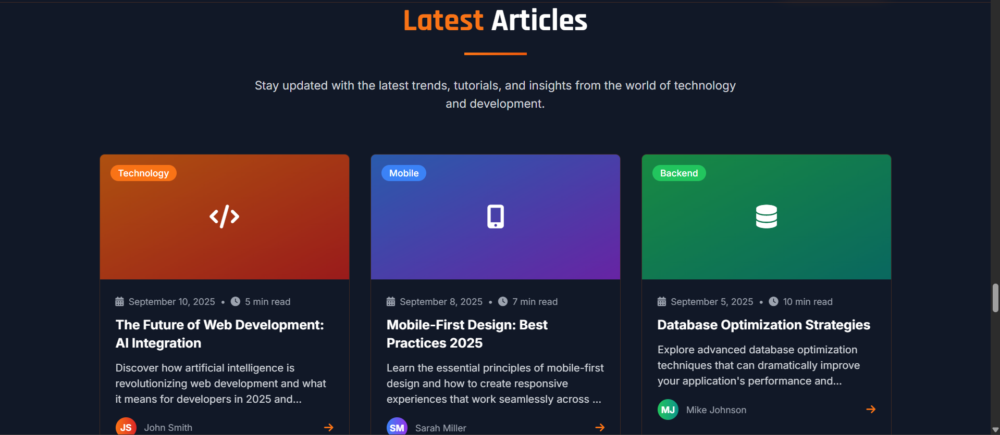
      <p align="center"><em>Read and share knowledge articles</em></p>
    </td>
  </tr>
</table>

<table>
  <tr>
    <td width="50%">
      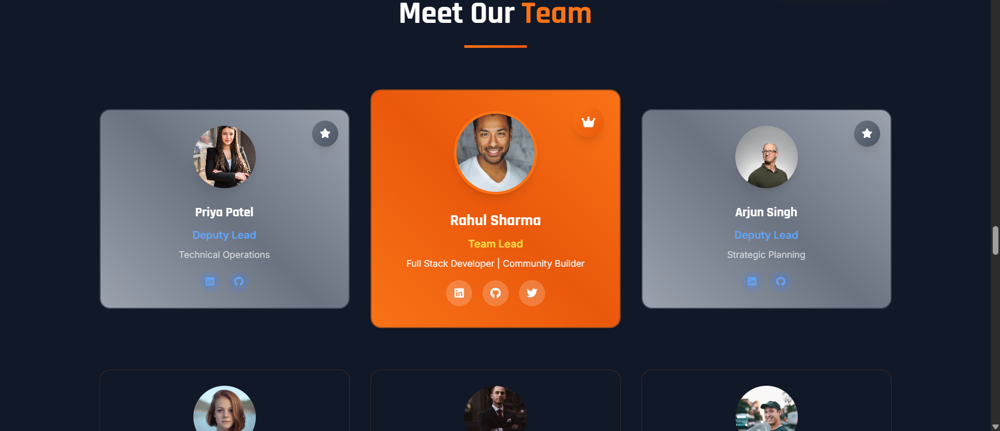
      <p align="center"><em>Meet our amazing team members</em></p>
    </td>
    <td width="50%">
      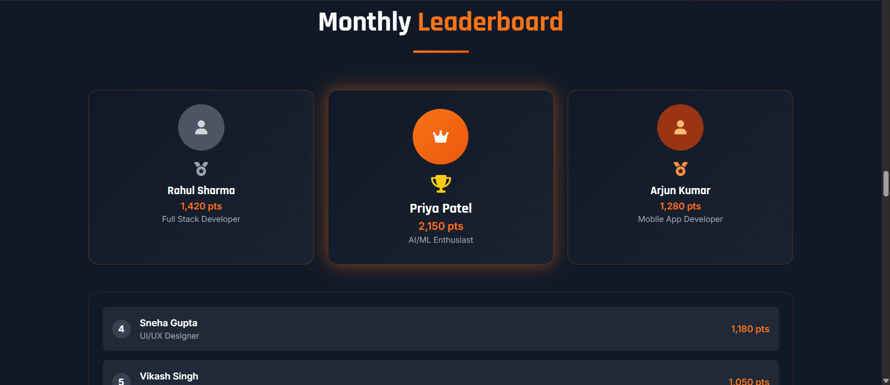
      <p align="center"><em>Community leaderboard and achievements</em></p>
    </td>
  </tr>
</table>

<table>
  <tr>
    <td width="50%">
      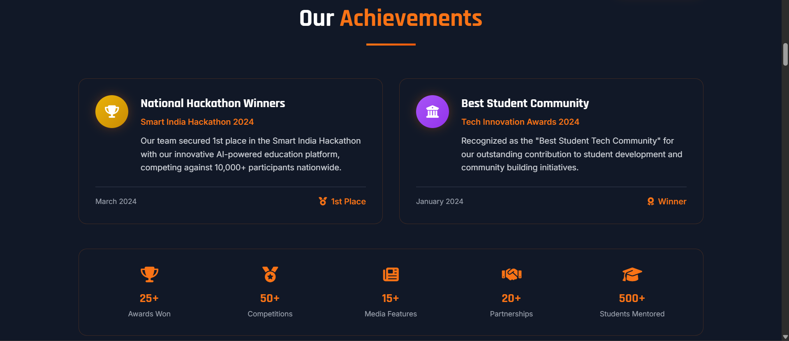
      <p align="center"><em>Track your progress and unlock badges</em></p>
    </td>
    <td width="50%">
      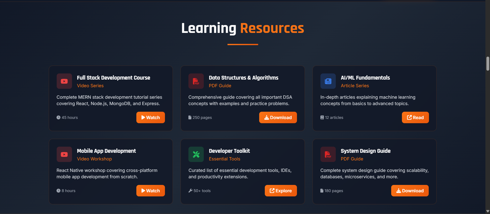
      <p align="center"><em>Curated learning resources</em></p>
    </td>
  </tr>
</table>

<table>
  <tr>
    <td width="50%">
      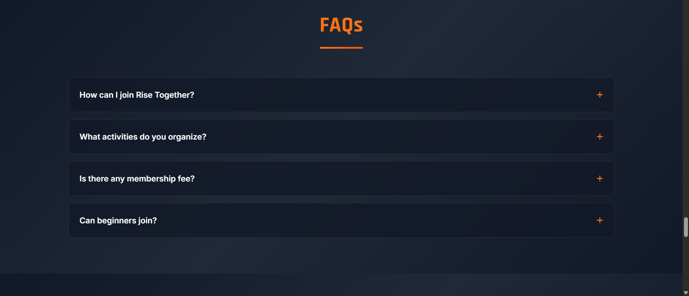
      <p align="center"><em>Frequently asked questions</em></p>
    </td>
    <td width="50%">
      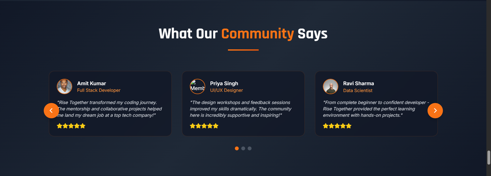
      <p align="center"><em>Share your feedback with us</em></p>
    </td>
  </tr>
</table>

</div>

---

## 🛠️ Tech Stack

| Category | Technology | Version |
|----------|-----------|---------|
| **Backend** | Django | 5.2.5 |
| **Language** | Python | 3.8+ |
| **Frontend** | TailwindCSS | - |
| **Database** | SQLite3 | - |
| **Editor** | TinyMCE | - |

> See [TECH_STACK.md](TECH_STACK.md) for complete tech stack details and dependencies.

---

## 🚀 Getting Started

Follow these steps to get Rise Together running on your local machine.

### Prerequisites

Make sure you have the following installed:

- **Python 3.8 or higher**
  ```sh
  python --version
  ```

- **pip** (Python package manager)
  ```sh
  pip --version
  ```

- **Git**
  ```sh
  git --version
  ```

### Installation

1. **Clone the repository**
   ```sh
   git clone https://github.com/risetogethercommunity/rise-together-web.git
   cd rise-together-web
   ```

2. **Create a virtual environment**
   ```sh
   # Windows
   python -m venv venv
   venv\Scripts\activate

   # macOS/Linux
   python3 -m venv venv
   source venv/bin/activate
   ```

3. **Install dependencies**
   ```sh
   pip install -r requirements.txt
   ```

4. **Apply database migrations**
   ```sh
   python manage.py makemigrations
   python manage.py migrate
   ```

5. **Create a superuser (admin account)**
   ```sh
   python manage.py createsuperuser
   ```

6. **Collect static files**
   ```sh
   python manage.py collectstatic
   ```

7. **Run the development server**
   ```sh
   python manage.py runserver
   ```

8. **Open your browser**
   
   Navigate to `http://127.0.0.1:8000/` to view the application.
   
   Admin panel: `http://127.0.0.1:8000/admin/`

### Environment Variables

Create a `.env` file in the root directory for sensitive information:

```env
SECRET_KEY=your-secret-key-here
DEBUG=True
ALLOWED_HOSTS=localhost,127.0.0.1,risetogether.tech

# Email Configuration (for password reset)
EMAIL_BACKEND=django.core.mail.backends.smtp.EmailBackend
EMAIL_HOST=smtp.gmail.com
EMAIL_PORT=587
EMAIL_USE_TLS=True
EMAIL_HOST_USER=your-email@gmail.com
EMAIL_HOST_PASSWORD=your-app-password

# Database (for production)
DATABASE_URL=your-database-url
```

---

## 🗺️ Roadmap

### Phase 1: Core Features ✅
- [x] User authentication system
- [x] Profile management
- [x] Blog platform
- [x] Projects showcase
- [x] Resources library
- [x] Contact form & newsletter

### Phase 2: Enhanced Features 🚧
- [ ] Real-time chat system
- [ ] Video tutorials section
- [ ] Project collaboration tools
- [ ] Mentor-mentee matching
- [ ] Skill assessment tests
- [ ] Achievement system

### Phase 3: Advanced Features 📋
- [ ] Live coding sessions
- [ ] Job board integration
- [ ] Community marketplace
- [ ] Mobile application
- [ ] API for third-party integrations
- [ ] Multi-language support

See the [open issues](https://github.com/risetogethercommunity/rise-together-web/issues) for a full list of proposed features and known issues.


---

## 📞 Contact

**Rise Together Community**

- 🌐 Website: [risetogether.tech](https://risetogether.tech)
- 📧 Email: contact@risetogether.tech
- 💬 Discord: [Join our server](https://discord.gg/risetogether)
- 🐦 Twitter: [@risetogether](https://twitter.com/risetogether)
- 📘 LinkedIn: [Rise Together](https://linkedin.com/company/risetogether)

**Project Link:** [https://github.com/risetogethercommunity/rise-together-web](https://github.com/risetogethercommunity/rise-together-web)

